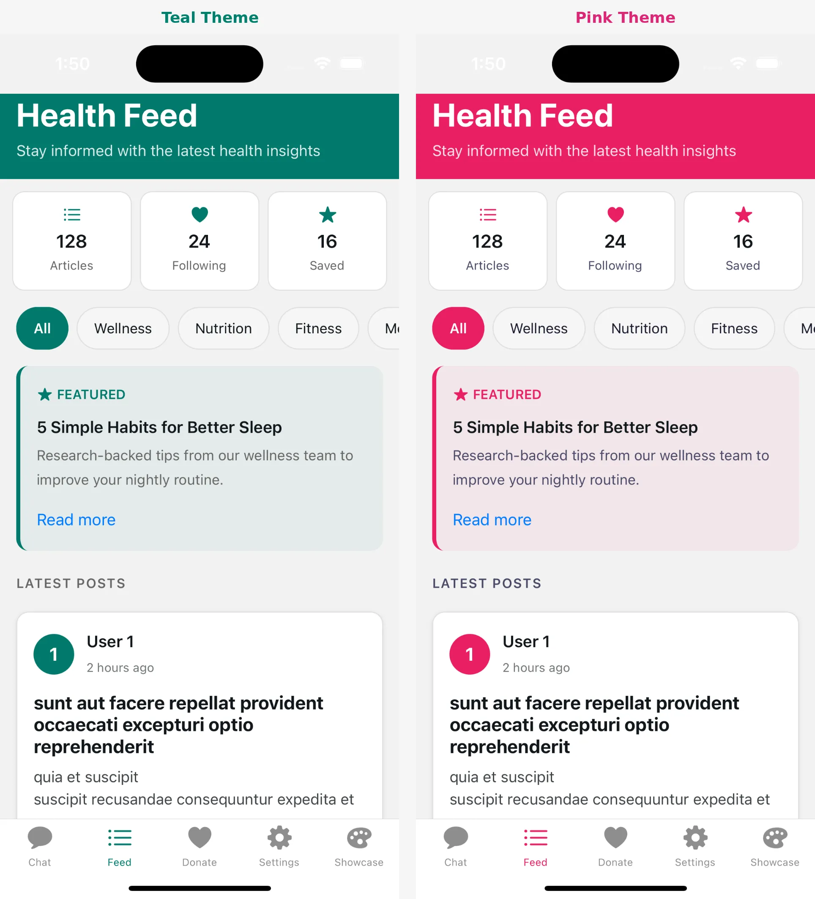
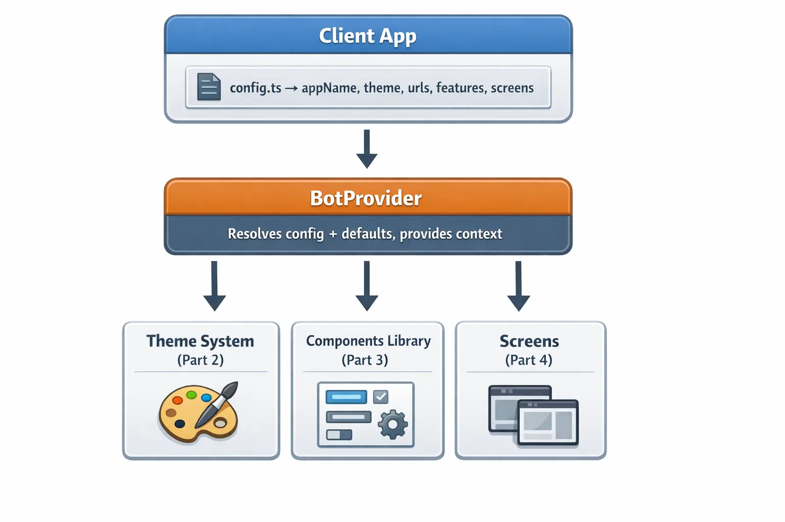

# White-Label SDK Series: Part 1 — The Big Picture

_A four-part guide to building production-ready white-label apps with React Native Expo_

---

**Series Navigation:**

- **Part 1: The Big Picture** (You are here)
- [Part 2: Deep Dive into Theming](/blog/react-native-white-labeling-part-2)
- [Part 3: Building Reusable Components](/blog/react-native-white-labeling-part-3)
- [Part 4: Configuration Architecture](/blog/react-native-white-labeling-part-4)

---

> **Sample Repository:** The complete SDK and example apps referenced in this series are available at [AcmeOrg/white-label-sdk-sample](https://github.com/AcmeOrg/white-label-sdk-sample). Smaller code snippets are shown inline; longer implementations can be explored in the repo.

You've built an app that works. Now the business wants to sell it to three different clients, each with their own brand. Marketing wants a dark mode. The enterprise client needs custom authentication. And everyone wants it yesterday.

This is the white-label problem, and solving it poorly means maintaining three codebases forever. Solving it well means one SDK, infinite brands.



## What We're Building

Over this four-part series, we'll construct a complete white-label SDK for React Native Expo. By the end, you'll have:

- A **theming system** that handles colors, typography, spacing, and dark mode automatically
- A library of **reusable components** that adapt to any brand
- A **configuration architecture** that lets clients customize everything without touching code
- **Preset screens** that work out-of-the-box and **base screens** for full control

Here's what the end result looks like for a client:

```typescript
// One config file = one branded app
const config: BotConfig = {
  appName: "Acme Health", // Display name used throughout the app
  theme: {
    brandColors: { primary: "#00796B" }, // Teal primary - cascades to buttons, links, etc.
  },
  features: {
    enableChat: true, // Toggle entire features on/off per client
    enableFeed: true,
  },
  urls: {
    base: { api: "https://api.acmehealth.example.com" }, // Backend endpoints
  },
};
```

Three files. Fully branded app. No SDK modifications.

_See the full config in the sample repository: [`examples/acme-health/config/bot.config.ts`](https://github.com/AcmeOrg/white-label-sdk-sample/tree/main/examples/acme-health/config/bot.config.ts)_

## The Architecture Overview



## SDK Folder Structure

Here's the full picture — don't worry, we'll build each piece step by step across the series.

```
bot-sdk/src/
├── index.ts                    # Public API - what clients import
├── types/
│   └── config.ts               # TypeScript interfaces for all config options
├── provider/
│   └── BotProvider.tsx         # Wraps app, resolves config, provides context
├── tokens/                     # Design tokens - the atomic visual values
│   ├── colors.ts               # Brand + semantic color palettes
│   ├── spacing.ts              # Consistent padding/margin scale
│   ├── borders.ts              # Border radius values
│   ├── typography.ts           # Font sizes, weights, line heights
│   ├── shadows.ts              # Shadow definitions per platform
│   └── components.ts           # Component-level token presets
├── hooks/                      # React hooks for consuming theme
│   ├── use-bot-theme.ts        # Primary hook - returns colors, spacing, etc.
│   ├── use-theme-color.ts      # Escape hatch for per-component overrides
│   └── use-color-scheme.ts     # Detects light/dark system preference
├── utils/                      # Internal utilities
│   └── mergeConfig.ts          # Deep merge logic for config resolution
├── components/                 # Pre-built themed UI components
│   ├── ThemedText.tsx          # Text that adapts to theme colors
│   ├── ThemedView.tsx          # Container with themed background
│   └── ui/                     # Buttons, cards, inputs, etc.
├── screens/                    # Complete screen implementations
│   ├── base/                   # Props-driven, full customization
│   └── presets/                # Config-driven, zero code needed
└── contexts/
    └── auth-context.tsx        # Authentication state + handlers
```

## The Three Pillars

### Pillar 1: Theming (Part 2)

The theming system handles everything visual:

- **Brand colors**: Primary, secondary, accent, destructive
- **Semantic colors**: Text, background, surface, border—with light/dark variants
- **Design tokens**: Spacing, border radius, typography scales
- **Automatic dark mode**: System preference detection and response

We'll build a system where changing one color in config updates every component automatically.

### Pillar 2: Reusable Components (Part 3)

Components are the building blocks:

- **Themed primitives**: ThemedText, ThemedView that adapt to any brand
- **Override patterns**: Component-level color overrides when needed
- **Composition**: Building complex UI from simple, themed pieces
- **Platform handling**: iOS, Android, and web differences

We'll explore how to build components that are flexible without being complicated.

### Pillar 3: Configuration (Part 4)

Configuration is what makes white-labeling possible:

- **Type-safe config**: Full TypeScript support with autocomplete
- **Smart defaults**: Everything works without configuration
- **Deep merging**: Partial configs merge with defaults intelligently
- **Two-tier screens**: Preset screens for quick setup, base screens for control
- **Render slots**: Inject custom content without rewriting screens

We'll design a configuration system that's powerful for advanced users and simple for everyone else.

## The Provider Pattern

Everything flows through a single provider:

```typescript
export default function RootLayout() {
  return (
    // BotProvider wraps the entire app at the root level
    // All child components can access the resolved config via hooks
    <BotProvider config={botConfig}>
      <App />
    </BotProvider>
  );
}
```

The provider does three things:

1. **Resolves configuration**: Merges user config with defaults
2. **Creates context**: Makes resolved values available everywhere
3. **Wraps auth**: Provides authentication state management

Every component, hook, and screen pulls from this context.

## Why This Approach Works

If you've worked on white-label projects before, you know how quickly things can spiral. Here's what keeps this one manageable:

- **One config, one brand.** No hunting through code to find where a color is defined. Everything lives in a single file.
- **SDK and config stay separate.** The SDK provides functionality. The config provides customization. They never mix, which means upgrading the SDK doesn't break client apps.
- **Start simple, go deep when you need to.** Preset screens get you a working app in minutes. Base screens with render slots are there when clients need full control.
- **TypeScript does the heavy lifting.** Config errors get caught before runtime, and clients get autocomplete on every option.
- **New features don't break old apps.** Every config option has a sensible default, so existing apps keep working when we add new options.

## Prerequisites

Before diving in, you should be comfortable with:

- React Native basics (components, hooks, StyleSheet)
- Expo Router for navigation
- TypeScript interfaces and generics
- React Context API

## Coming Up

In **Part 2**, we'll build the complete theming system—design tokens, color schemes, the useTheme hook, and automatic dark mode support.

In **Part 3**, we'll create the component library—ThemedText, ThemedView, and patterns for building your own themed components.

In **Part 4**, we'll design the configuration architecture—type definitions, the provider, two-tier screens, and render slots.

Let's dive in.

---

**Next: [Part 2 — Deep Dive into Theming →](/blog/react-native-white-labeling-part-2)**

---

Photo by [Romain Dégrés]("https://unsplash.com/@raaaomin?utm_source=unsplash&utm_medium=referral&utm_content=creditCopyText") on [Unsplash]("https://unsplash.com/photos/gray-and-black-canon-ae-1-camera-on-wooden-surface-7SmpToKLiNA?utm_source=unsplash&utm_medium=referral&utm_content=creditCopyText")
