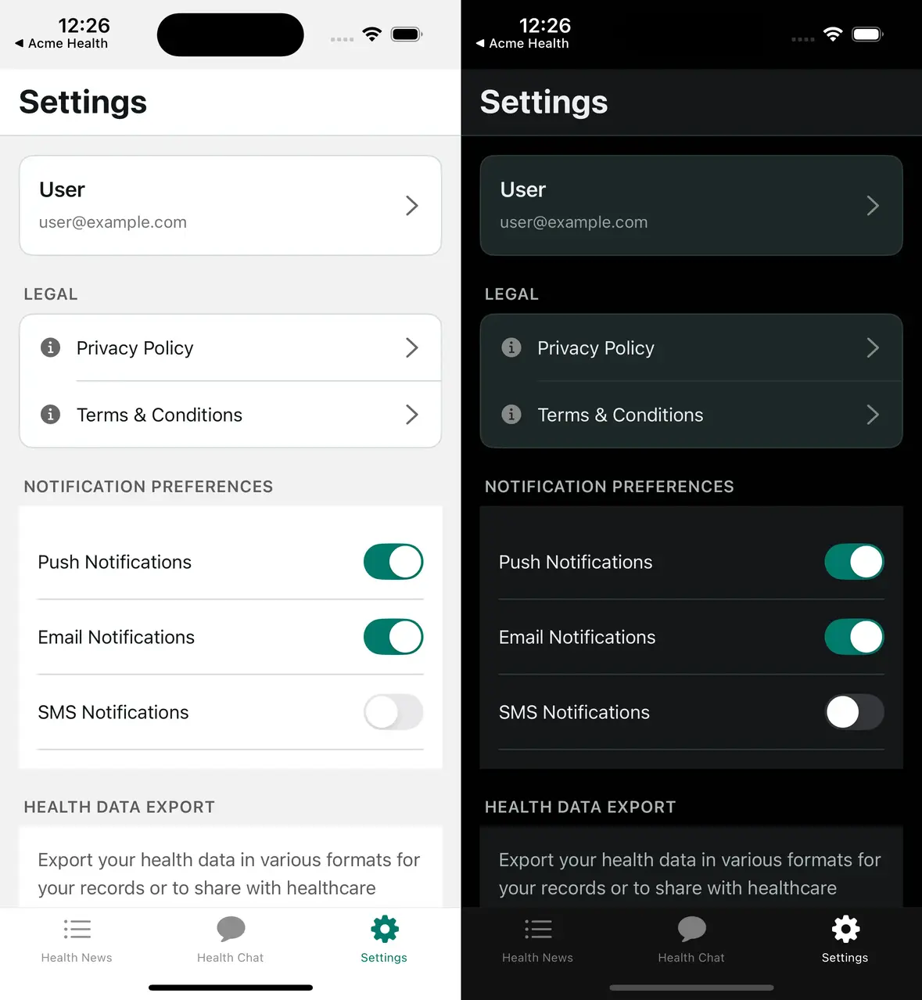

# White-Label SDK Series: Part 2 — Deep Dive into Theming

*Building a flexible, type-safe theming system with automatic dark mode*

---

**Series Navigation:**
- [Part 1: The Big Picture](/blog/react-native-white-labeling-part-1)
- **Part 2: Deep Dive into Theming** (You are here)
- [Part 3: Building Reusable Components](/blog/react-native-white-labeling-part-3)
- [Part 4: Configuration Architecture](/blog/react-native-white-labeling-part-4)

---

> **Sample Repository:** The complete SDK and example apps referenced in this series are available at [AcmeOrg/white-label-sdk-sample](https://github.com/AcmeOrg/white-label-sdk-sample). Smaller code snippets are shown inline; longer implementations can be explored in the repo.

Your theming system is going to make or break the whole white-label experience. Get it right, and clients can launch a fully branded app by changing a few hex codes. Get it wrong, and you'll spend forever hunting down hardcoded colors.

In this part, we'll build a theming system that's:
- **Hierarchical**: Brand colors flow into semantic colors automatically
- **Type-safe**: TypeScript catches invalid color names
- **Dark-mode ready**: Responds to system preferences
- **Override-friendly**: Components can escape the system when needed

## Design Tokens: The Foundation

Design tokens are the atomic values that define your visual language — like dialing in the settings on a camera before you start shooting. They're the variables that every component references instead of hardcoded values. When a client changes a token, every component using that token updates automatically.

We organize tokens into layers, each building on the previous one.

### Layer 1: Brand Colors

Brand colors are what clients customize first—they're the "personality" of the app. These include the primary action color (buttons, links), secondary accents, and status colors (success, warning, destructive).

The key insight is that brand colors are *intentional*. A primary color of `#007AFF` (iOS blue) sends a different message than `#E91E63` (vibrant pink) or `#00796B` (professional teal). Clients choose these colors to match their existing brand identity.

We provide sensible defaults (typically iOS system colors), but expect most clients to override at least the primary color.

### Layer 2: Semantic Colors

Okay, so we have brand colors. But you don't want developers reaching for `brandColors.primary` every time they need to style text. That's where semantic colors come in. Instead of saying "use `#11181C` for text," we say "use the `text` color." The semantic name describes *purpose*, not appearance.

Why does this matter? Because semantic colors let us:

- **Swap entire palettes**: Light mode and dark mode use different values for the same semantic names
- **Maintain consistency**: Every component using `colors.text` updates together
- **Communicate intent**: A developer sees `colors.destructive` and knows it's for dangerous actions

Common semantic colors include:

- **Text hierarchy**: `text`, `textSecondary`, `textTertiary` (establishes visual importance)
- **Backgrounds**: `background`, `surface`, `surfaceSecondary` (canvas and elevated content)
- **Boundaries**: `border`, `borderSecondary` (dividers and containers)
- **Interactive**: `tint` (links, active states—often connected to brand primary)
- **Inputs**: `inputBackground`, `inputBorder`, `inputPlaceholder`

The critical connection: in light mode, `tint` typically equals `brandColors.primary`. This is how changing one brand color cascades to every interactive element.

*See the full brand and semantic color definitions: [`packages/sdk/src/tokens/colors.ts`](https://github.com/AcmeOrg/white-label-sdk-sample/tree/main/packages/sdk/src/tokens/colors.ts)*

### Layer 3: Light and Dark Variants

Each semantic color needs concrete values for both modes. Dark mode isn't just "invert the colors"—it requires intentional design:

- **Text**: Off-white (`#ECEDEE`) instead of pure white, which is too harsh
- **Surfaces**: Lighter than background (opposite of light mode) to create elevation
- **Shadows**: Higher opacity because they're less visible on dark backgrounds
- **Some brand colors**: May need adjustment for sufficient contrast

We define a `Colors` object with `light` and `dark` keys, each containing the full set of semantic colors.



### Layer 4: Spacing and Border Radius

You've seen apps where the padding is 16px here, 14px there, 20px somewhere else. You can't always put your finger on *why* it looks off, but it does. A spacing scale fixes that.

A typical spacing scale: `4, 8, 12, 16, 20, 24, 32, 48` (in density-independent pixels). Name them semantically: `xs`, `sm`, `md`, `lg`, `xl`, `xxl`.

Border radius works similarly. Larger values feel friendlier; smaller values feel more professional. A healthcare app might use `4-8px` radii; a consumer social app might use `16-24px`. Clients can override these to match their brand personality.

## Theme Resolution: From Partial Config to Complete Theme

Here's the crucial question: if clients only provide *partial* configuration, how do we end up with a *complete* theme?

The answer is **deep merging with smart defaults**. When a client provides:

```typescript
theme: {
  brandColors: { primary: '#00796B' }
}
```

We merge it with our defaults to produce a complete theme where:
- `primary` is the client's `#00796B`
- All other brand colors use our defaults
- All semantic colors use defaults, BUT `tint` automatically uses the new primary

This cascade is the key to the whole system. The merging happens in a `resolveTheme()` function that:

1. **Merges brand colors**: Spread defaults, then spread user overrides (later values win)
2. **Builds light palette**: Merge defaults with overrides, then connect `tint` to the resolved primary
3. **Builds dark palette**: Same pattern, but dark mode `tint` might differ
4. **Merges layout tokens**: Spacing and border radius follow the same pattern

The output type has no optionals—every value is guaranteed to exist. This means components never need to check "does this color exist?" They just use it.

## Detecting the Color Scheme

React Native provides `useColorScheme()` out of the box. For web, you'll need a custom hook that:
- Returns `null` during SSR (to avoid hydration mismatches)
- Uses the `matchMedia` API to detect system preference
- Subscribes to changes (when users toggle system dark mode)

Expo/Metro automatically picks platform-specific files (`.ios.tsx`, `.android.tsx`, `.web.tsx`), so you can provide different implementations without conditional logic in your components.

## The useTheme Hook

The `useTheme` hook is the primary interface between your theme system and your components. It does three things:

1. **Gets the resolved theme from context** (the merged result of defaults + client config)
2. **Detects the current color scheme** (light or dark)
3. **Returns everything a component needs** in a convenient shape

What does "convenient shape" mean? Components typically need:
- `colors` — the semantic colors for the *current* mode (not both modes)
- `brandColors` — always available, regardless of mode
- `spacing` and `borderRadius` — layout tokens
- `isDark` — boolean for conditional logic

Components destructure only what they need: `const { colors, spacing } = useTheme()`. This keeps dependencies explicit and makes the code self-documenting.

**Usage looks like:**

```typescript
function MyComponent() {
  const { colors, spacing, isDark } = useTheme();

  return (
    <View style={{
      backgroundColor: colors.surface,
      padding: spacing.lg,
      borderColor: colors.border,
    }}>
      <Text style={{ color: colors.text }}>Hello</Text>
    </View>
  );
}
```

No hardcoded values. Every style references the theme. Change the theme, and this component updates automatically.

*See the full hook implementation: [`packages/sdk/src/hooks/use-bot-theme.ts`](https://github.com/AcmeOrg/white-label-sdk-sample/tree/main/packages/sdk/src/hooks/use-bot-theme.ts)*

## The Escape Hatch: useThemeColor

Sometimes a component needs to break from the theme—a promotional banner with unique colors, or a special card that doesn't match the standard surface color.

The `useThemeColor` hook handles this. It takes optional light/dark overrides and a fallback semantic color name. If overrides are provided, it uses them; otherwise, it falls back to the theme.

This lets you build components that:
- Use theme colors by default (when no overrides passed)
- Accept custom colors when needed (respecting light/dark mode)
- Never hardcode colors directly

Use this sparingly. Most components should just use `useTheme()`. The escape hatch is for intentional exceptions, not everyday use.

## Putting It Together: The Type System

The type system is where TypeScript really shines for white-labeling. We use a key pattern: **input types are partial, output types are complete**.

The `ThemeConfig` interface (what clients provide) uses `Partial<>` everywhere. Clients only specify what they want to override—everything else is optional.

The `ResolvedTheme` interface (what the SDK guarantees after resolution) has no optionals. Every value is defined. This means components never need null checks or fallbacks; they just use the values.

This asymmetry is intentional. It makes the client experience simple (provide only what you need) while making the component experience safe (everything is guaranteed to exist).

## Real-World Config Examples

The power of this system is progressive complexity. Clients start simple and add customization as needed.

**Minimal**: Just a primary color. This single value cascades to buttons, links, active states, tab icons—every interactive element.

```typescript
theme: { brandColors: { primary: '#E91E63' } }
```

**Moderate**: Brand colors plus some semantic overrides. Maybe the background should be off-white instead of pure white, or the destructive color needs to match company guidelines.

```typescript
theme: {
  brandColors: { primary: '#00796B', destructive: '#D32F2F' },
  colors: {
    light: { background: '#FAFAFA', surface: '#FFFFFF' }
  }
}
```

**Full control**: Complete custom palettes for both modes, custom spacing, custom radii. Some enterprise clients want pixel-perfect matching to their existing design system.

The key insight: all three levels use the same SDK. The client's complexity is their choice, not a requirement.

*The advanced example demonstrates full semantic color overrides: [`examples/acme-health-advanced/config/bot.config.ts`](https://github.com/AcmeOrg/white-label-sdk-sample/tree/main/examples/acme-health-advanced/config/bot.config.ts)*

## Common Patterns

Here are a few things we ran into while building with this system that are worth calling out:

**Derived colors**: Sometimes you need a color that's a variant of another—slightly lighter, or different between modes. Compute it in a custom hook or inline, using `isDark` to branch.

**Status mapping**: Components like status badges map semantic states (success, warning, error) to brand colors. A simple object lookup keeps this clean and maintainable.

**Theme-aware shadows**: Shadows behave differently in dark mode—they need higher opacity to be visible, and often use pure black instead of gray. The `isDark` boolean from `useTheme()` makes this conditional styling straightforward.

**Mode-specific adjustments**: Some colors can't be the same between modes. White text on a colored button works in light mode but may need adjustment in dark mode. The theme system gives you the tools; intentional design decisions are still required.

## Trade-offs and Considerations

**Token proliferation**: 18 semantic colors might be overkill for simple apps. Start with fewer and add as needed.

**Dark mode consistency**: It's tempting to just invert colors. Don't. Dark mode needs intentional design—shadows behave differently, contrast ratios change, and some colors need manual adjustment.

**Performance**: Every component using `useTheme` re-renders on theme change. For most apps this is fine. For performance-critical lists, consider passing colors as props or memoizing.

**Naming conventions**: `textSecondary` vs `secondaryText`? Pick a convention and stick with it. We prefer `{category}{variant}` for consistency.

## What's Next

We've built the foundation. In **Part 3**, we'll create the components that consume this theme system—ThemedText, ThemedView, and patterns for building your own themed components.

---

**Next: [Part 3 — Building Reusable Components →](/blog/react-native-white-labeling-part-3)**

---

Photo by [Yosuke Ota](https://unsplash.com/@yosuke_ota?utm_source=unsplash&utm_medium=referral&utm_content=creditCopyText) on [Unsplash](https://unsplash.com/photos/collection-of-vintage-cameras-displayed-in-a-museum-OzJ_Ka8O9J0?utm_source=unsplash&utm_medium=referral&utm_content=creditCopyText)