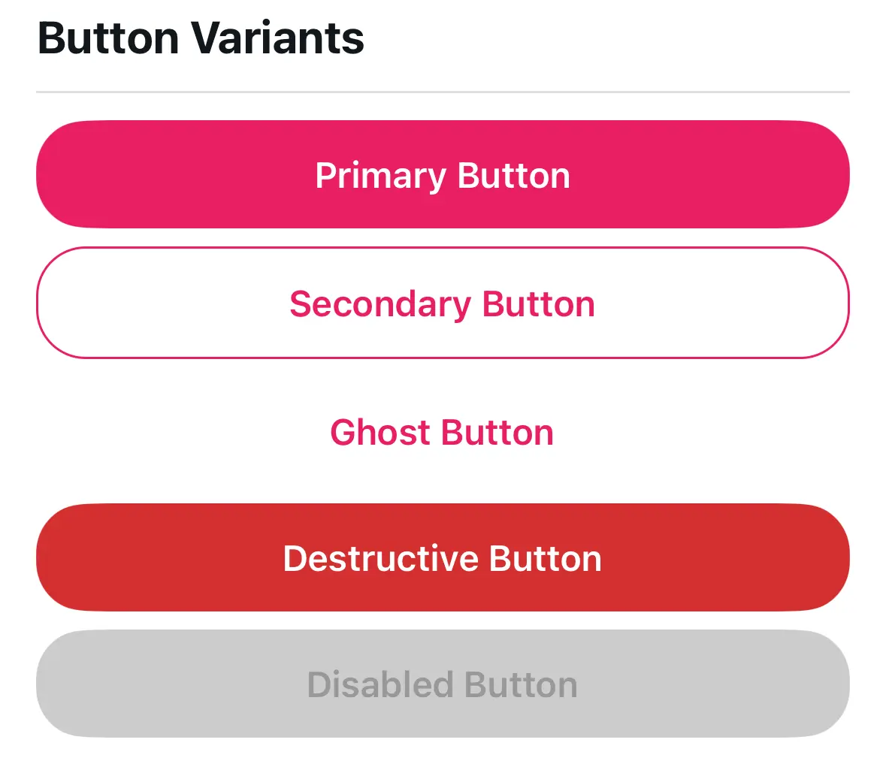

# White-Label SDK Series: Part 3 — Building Reusable Components

*Creating flexible, theme-aware components that adapt to any brand*

---

**Series Navigation:**
- [Part 1: The Big Picture](/blog/react-native-white-labeling-part-1)
- [Part 2: Deep Dive into Theming](/blog/react-native-white-labeling-part-2)
- **Part 3: Building Reusable Components** (You are here)
- [Part 4: Configuration Architecture](/blog/react-native-white-labeling-part-4)

---

> **Sample Repository:** The complete SDK and example apps referenced in this series are available at [atomicrobot/react-native-white-label-blog-sample-repo](https://github.com/atomicrobot/react-native-white-label-blog-sample-repo). Smaller code snippets are shown inline; longer implementations can be explored in the repo.

> **In brief**: Tokens and hooks are only as good as the components that use them. This post builds the component layer of the white-label SDK — themed primitives (`ThemedText`, `ThemedView`), the variant pattern for buttons and cards, and a composition approach where developers add UI without ever hardcoding a color or spacing value.

Tokens and hooks are great, but they don't mean much until components are actually using them. In Part 2, we built the foundation — tokens, hooks, and resolution logic. Now let's build the pieces that turn all of that into real UI — the component layer that makes a [React Native](/services/react-native-development/) white-label SDK actually feel polished.

The goal: components that look native to any brand without anyone touching the code.

## The Foundation: Themed Primitives

The first components to build are themed versions of React Native's primitives: `View` and `Text`. These form the foundation everything else builds on.

### ThemedView

`ThemedView` wraps the standard `View` and automatically applies the theme's background color. The pattern is straightforward:

1. Extend the standard `ViewProps` to inherit all normal props
2. Add optional `lightColor` and `darkColor` props for overrides
3. Use `useThemeColor` to get the resolved color (override if provided, theme's `background` otherwise)
4. Merge the themed style with the user's `style` prop

The user's style comes last in the array, so they can override the background if needed. All standard View props pass through unchanged.

### ThemedText

`ThemedText` follows the same pattern but adds **type variants** for typography hierarchy. Instead of manually setting font sizes everywhere, you use:

```tsx
<ThemedText type="title">Welcome</ThemedText>
<ThemedText type="subtitle">Getting started</ThemedText>
<ThemedText>Regular body text</ThemedText>
<ThemedText type="link" onPress={handlePress}>Learn more</ThemedText>
```

Key design decision: **links always use the brand primary color**, not the text color. Users expect links to look like links regardless of surrounding text. This creates consistent UX across the entire app.

The style merge order matters: themed color → variant styles → user overrides. This lets users override any default while keeping sensible baselines.

*See the full implementations: [`ThemedText.tsx`](https://github.com/atomicrobot/react-native-white-label-blog-sample-repo/tree/main/packages/sdk/src/components/ThemedText.tsx) and [`ThemedView.tsx`](https://github.com/atomicrobot/react-native-white-label-blog-sample-repo/tree/main/packages/sdk/src/components/ThemedView.tsx)*

### Text Hierarchy

For text hierarchy (primary, secondary, tertiary), you have two options:

1. **Add types to ThemedText**: Map type names to semantic color names (`secondary` → `textSecondary`)
2. **Create separate components**: `SecondaryText`, `CaptionText`, etc.

We prefer option 1 for simplicity—one component that handles all text needs. But if your typography system is complex, separate components can be cleaner.

## Beyond Primitives: Themed UI Components

With `ThemedView` and `ThemedText` in place, you can build higher-level components. The pattern is always the same: use `useTheme()` to get colors and tokens, then apply them to styles.

> **Heads up:** The `ThemedCard`, `ThemedButton`, and `ThemedInput` components discussed below are illustrative patterns — the SDK uses these patterns internally in its screen implementations rather than exporting them as standalone components. You'd build these for your own app using the same `useTheme()` approach. See [`examples/acme-health-advanced/components/`](https://github.com/atomicrobot/react-native-white-label-blog-sample-repo/tree/main/examples/acme-health-advanced/components/) for working examples.

### The Variant Pattern

Most UI components need variants—different visual styles for different contexts. Buttons have primary, secondary, ghost. Cards have elevated, outlined, filled. Inputs have default and filled.

The cleanest way to handle variants is an object that maps variant names to style objects:

```typescript
const variants = {
  primary: { backgroundColor: brandColors.primary, textColor: '#FFFFFF' },
  secondary: { backgroundColor: colors.surface, textColor: brandColors.primary },
  ghost: { backgroundColor: 'transparent', textColor: brandColors.primary },
};
```

Then apply the current variant: `variants[variant]`. Adding new variants means adding to the object—no conditional logic changes needed.

### Themed Buttons

Buttons showcase how brand colors create visual hierarchy. The primary button uses `brandColors.primary` as its background—it's the most prominent action. Secondary buttons reverse this (brand color text on neutral background). Ghost buttons are text-only.

Key consideration: each variant must define both background AND text color to ensure proper contrast. Don't assume text will always be white or always be dark.



### Themed Cards

Cards elevate content visually. The three common patterns:

- **Elevated**: Shadow creates depth (needs mode-specific tuning—darker shadows in dark mode)
- **Outlined**: Border instead of shadow (cleaner, works well in both modes)
- **Filled**: Different background color (simplest, no shadow or border)

### Themed Inputs

Inputs need multiple theme colors working together: text color, background, border, and placeholder. Remember that `placeholderTextColor` is a prop, not a style—you must set it explicitly.

## The Composition Pattern

This is where it starts to pay off — composing themed components together. A `ProfileCard` might contain a `ThemedCard`, `ThemedText`, and `ThemedButton` — none of which have hardcoded colors or sizes.

The person building `ProfileCard` doesn't think about colors at all. They just think about layout and content. The theme handles the rest.

```tsx
<ThemedCard variant="elevated">
  <ThemedText type="subtitle">{name}</ThemedText>
  <ThemedText type="secondary">{email}</ThemedText>
  <ThemedButton title="Edit Profile" variant="secondary" onPress={onEdit} />
</ThemedCard>
```

Change the theme, and every `ProfileCard` in the app updates. No hunting through components to find hardcoded values.

## Icons and Platform-Specific Components

**Icons** need theme colors too. Create a `ThemedIcon` wrapper around your icon library that maps semantic color names (`primary`, `secondary`, `brand`) to resolved theme values.

**Platform-specific components** use file extensions: `IconSymbol.tsx`, `IconSymbol.ios.tsx`. Metro bundler automatically picks the right file. This keeps platform differences isolated without conditional logic cluttering your components.

*See [`IconSymbol.tsx`](https://github.com/atomicrobot/react-native-white-label-blog-sample-repo/tree/main/packages/sdk/src/components/ui/IconSymbol.tsx) for a platform-specific component example.*

## Building Your Own Themed Components

Here's the playbook we follow every time we create a new themed component:

1. **Figure out your theme dependencies first.** What colors, spacing, or tokens does this component need? Destructure only what you use from `useTheme()` — this documents the component's visual dependencies at a glance.

2. **Make it work with zero configuration.** Default variant, default size, default behavior. A component should look good the moment you drop it in.

3. **Let people override things.** Accept a `style` prop and merge it with your internal styles (user styles last, so they win). Forward remaining props with `...props`.

4. **No hardcoded values. Seriously.** Every color should come from `colors.*` or `brandColors.*`. Every spacing value from `spacing.*`. This is the whole point of the system — hardcoded values break the moment a client customizes.

5. **Handle dark mode on purpose.** It's not just inverted colors. Shadows need different opacity, overlays need different colors, some brand colors may need adjustment. Use `isDark` from `useTheme()` for conditional styling.

## Component Export Strategy

Organize exports by category in an `index.ts` file:
- Primitives (ThemedView, ThemedText)
- Inputs (ThemedInput, ThemedButton)
- Layout (ThemedCard)
- Composed (ProfileCard, etc.)

Export both the component and its props type for TypeScript users. Clients import what they need from a single clean path.

## Trade-offs

**Flexibility vs. Consistency**: More props mean more flexibility but also more ways to break visual consistency. We lean toward fewer props with escape hatches (like `lightColor`/`darkColor`).

**Performance**: Creating styles inside components (using theme values) means new style objects each render. For most components this is fine. For lists, consider `useMemo` or StyleSheet with theme-derived values.

**Bundle size**: Every component adds to the bundle. Only export what clients actually need.

## What's Next

We have tokens (Part 2) and components (Part 3). In **Part 4**, we'll build the configuration architecture—the provider that ties everything together, two-tier screens, and render slots that let clients customize without code changes.

Building a white-label or multi-brand [mobile app](/services/mobile-app-development/) and want to talk through the component architecture? Atomic Robot's mobile development team works with teams navigating exactly these decisions. [Reach out to us](/contact/) — we'd be happy to help.

---

**Next: [Part 4 — Configuration Architecture →](/blog/react-native-white-labeling-part-4)**

---

Photo by [Chris Weiher](https://unsplash.com/@chrisvomradio?utm_source=unsplash&utm_medium=referral&utm_content=creditCopyText) on [Unsplash](https://unsplash.com/photos/collection-of-camera-lenses-displayed-on-a-shelf-_yibBt_J9dQ?utm_source=unsplash&utm_medium=referral&utm_content=creditCopyText)