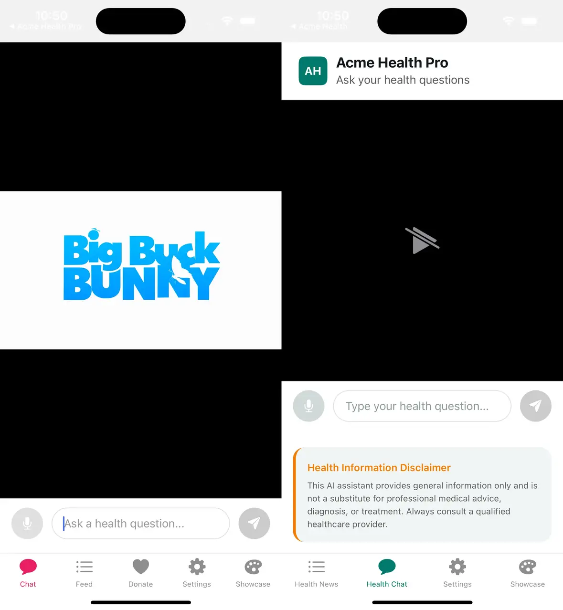

# White-Label SDK Series: Part 4 — Configuration Architecture

*Designing a type-safe config system with two-tier screens and render slots*

---

**Series Navigation:**
- [Part 1: The Big Picture](/blog/react-native-white-labeling-part-1)
- [Part 2: Deep Dive into Theming](/blog/react-native-white-labeling-part-2)
- [Part 3: Building Reusable Components](/blog/react-native-white-labeling-part-3)
- **Part 4: Configuration Architecture** (You are here)

---

> **Sample Repository:** The complete SDK and example apps referenced in this series are available at [AcmeOrg/white-label-sdk-sample](https://github.com/AcmeOrg/white-label-sdk-sample). Smaller code snippets are shown inline; longer implementations can be explored in the repo.

We've built the theming system and component library. Now comes the piece that makes white-labeling actually work: the configuration architecture.

The goal: **clients launch a fully branded app by editing one config file, with zero code changes to the SDK.**

## The Config Interface

Everything flows from a single, well-typed configuration interface. The design philosophy: **only `appName` is required; everything else has sensible defaults**.

```typescript
export interface BotConfig {
  appName: string;               // Required: displayed in headers, about screens
  theme?: ThemeConfig;           // Colors, spacing, typography (Part 2)
  urls?: UrlConfig;              // API endpoints, web views, legal links
  features?: FeatureFlagsConfig; // Enable/disable entire features
  auth?: AuthConfig;             // Authentication settings
  screens?: ScreensConfig;       // Per-screen customization
}
```

Each section handles a different concern. This separation matters because different team members care about different sections—designers focus on theme, backend devs on URLs, product managers on feature flags.

{/* TODO: Screenshot — TypeScript autocomplete in action on the BotConfig interface, showing IntelliSense suggestions for config options. */}


### Config Sections at a Glance

**Theme** (covered in Part 2): Brand colors, semantic colors, spacing, border radius. The foundation of visual customization.

**URLs**: Organized by purpose—base API endpoints, web view URLs (help center, external forms), legal pages (required for app store compliance), social links, support channels. An index signature allows custom keys without TypeScript complaints.

**Feature Flags**: Boolean toggles for entire capabilities. `enableAnalytics: false` completely removes the analytics feature. Much cleaner than commenting out code or conditional imports. The index signature lets clients add custom flags.

**Auth**: Settings like storage key prefix (for AsyncStorage), session timeout, email verification requirements. The actual auth *logic* is handled differently (see Pluggable Authentication below).

**Screen Configuration**: Per-screen customization—login titles, chat placeholders, which sections appear in settings. This covers the customization that doesn't warrant a code change.

## The Provider

The provider is where raw configuration becomes resolved context. It takes the client's partial config, merges it with defaults, and makes the complete result available to every component.

The key responsibilities:
1. **Merge each config section** with its defaults (spread operator, user values override)
2. **Memoize the result** so we only re-resolve when config changes
3. **Provide context** to all descendants
4. **Wrap auth** with the authentication provider

### Focused Hooks

Instead of one giant `useConfig()` hook, provide focused alternatives:
- `useBotTheme()` → just the theme
- `useBotUrls()` → just the URLs
- `useBotFeatures()` → just the feature flags
- `useBotScreenConfig('chat')` → config for a specific screen

This keeps component code clean. Instead of `const config = useBotConfig(); const features = config.features;`, you write `const features = useBotFeatures();`. Dependencies are explicit.

### Default Values

Defaults are what make the SDK work out-of-the-box. A minimal config of just `{ appName: 'My App' }` produces a fully functional app because every other value has a sensible default.

Feature flags default to `true` (all features enabled). URLs default to empty strings (components handle missing URLs gracefully). Theme defaults to the values from Part 2.

This design means clients only configure what they *want* to change, not what they *must* provide.

## Two-Tier Screens

This is where white-labeling gets powerful — think of it like swapping lenses on a camera body. Same core, totally different output. We provide **two versions of every screen**:



### Tier 1: Preset Screens

Preset screens are config-driven and zero-code. They read from `BotConfig` and translate configuration into props for the underlying Base screen.

**Client usage is one line:**
```typescript
// app/(tabs)/chat.tsx
export { ChatScreen as default } from 'bot-sdk/screens';
```

That's it. The chat placeholder, voice input toggle, and other options come from `bot.config.ts`. Change the config, restart the app, see the changes. No code modifications.

Preset screens are perfect for clients who want customization through configuration alone.

*See this pattern in action: [`examples/acme-health/app/(tabs)/chat.tsx`](https://github.com/AcmeOrg/white-label-sdk-sample/tree/main/examples/acme-health/app/(tabs)/chat.tsx)*

### Tier 2: Base Screens

Base screens are props-driven and fully customizable. When config isn't enough—when a client needs custom callbacks, injected UI, or behavior changes—they use Base screens directly.

Base screen props are organized by category:
- **Content**: What to display (video source, placeholder text)
- **Features**: Behavior toggles (enable voice input, auto-play video)
- **Callbacks**: Event handlers (onSubmitQuestion, onRecordingComplete)
- **Render slots**: Inject custom UI (headerContent, footerContent)
- **Styling**: Escape hatches (containerStyle)

**Client usage with customization:**
```typescript
import { BaseChatScreen } from 'bot-sdk/screens';

export default function CustomChat() {
  return (
    <BaseChatScreen
      onSubmitQuestion={handleQuestion}
      placeholder="Ask a health question..."
      headerContent={<BrandedHeader />}
      enableVoiceInput={true}
    />
  );
}
```

The client controls exactly what they need while the SDK handles everything else.

*See a customized base screen: [`examples/acme-health-advanced/app/(tabs)/chat.tsx`](https://github.com/AcmeOrg/white-label-sdk-sample/tree/main/examples/acme-health-advanced/app/(tabs)/chat.tsx)*

## Render Slots: The Injection Pattern

Render slots let clients inject custom content at specific points in a screen without rewriting the whole thing. Think of them as named insertion points:

- `headerContent` — top of screen
- `beforeProfile` — just before the profile section
- `afterProfile` — just after the profile section
- `footerContent` — bottom of screen

The pattern inside the Base screen is: `{slot} → {conditional built-in} → {slot}`. This lets clients add content before, after, or instead of built-in sections.

For more dynamic needs, an `additionalSections` prop accepts an array of `{ id, title, render }` objects. Each becomes a new section with its own header. Clients can add notification preferences, privacy controls, or any custom UI.

**Example: heavily customized settings screen:**
```typescript
<BaseSettingsScreen
  showLogout={true}
  beforeLogout={<DangerZone><ClearCacheButton /></DangerZone>}
  additionalSections={[
    { id: 'notifications', title: 'Notifications', render: () => <NotificationPreferences /> },
    { id: 'privacy', title: 'Privacy', render: () => <PrivacyControls /> },
  ]}
  footerContent={<AppVersion />}
/>
```

The client gets exactly the settings screen they need without forking SDK code.

*See render slots in practice: [`examples/acme-health-advanced/app/(tabs)/settings.tsx`](https://github.com/AcmeOrg/white-label-sdk-sample/tree/main/examples/acme-health-advanced/app/(tabs)/settings.tsx)*

## WebView-Based Screens

Some "screens" are just branded web views—help centers, external forms, documentation pages. The pattern is simple:

1. **Preset screen** reads URL from config
2. **Base screen** displays it in a WebView with themed background
3. If URL is missing, show an empty state

This keeps web content outside the app bundle while maintaining a native feel.

## Pluggable Authentication

Auth is tricky because every client has a different backend. We solve this with **optional handlers**.

The SDK provides a stable interface that components code against: `isAuthenticated`, `isLoading`, `user`, `login()`, `logout()`. The implementation—how these actually work—comes from handlers the client provides.

**Demo mode** (no handlers): Auth always succeeds. Perfect for development and demos. Just wrap your app in `BotProvider` without passing `authHandlers`.

**Production mode** (with handlers): Pass `authHandlers` to connect to your actual backend. Each handler wraps your API calls and returns success data or null on failure. The SDK handles storing tokens, updating state, and managing the auth flow.

```typescript
<BotProvider
  config={config}
  authHandlers={{
    onLogin: async (email, password) => {
      const res = await api.login(email, password);
      return res.ok ? { token: res.token, user: res.user } : null;
    },
    onSignup: async (email, password, name) => { /* ... */ },
    onLogout: async () => { await api.logout(); },
  }}
>
```

This separation means the SDK doesn't know or care what backend you use. Firebase, Auth0, custom REST API—it all works through the same handler interface.

*See a production auth handler setup: [`examples/acme-health-advanced/app/_layout.tsx`](https://github.com/AcmeOrg/white-label-sdk-sample/tree/main/examples/acme-health-advanced/app/_layout.tsx)*

## Package Exports

Multiple entry points keep imports clean and bundle sizes manageable:

- `bot-sdk` — Main: BotProvider, config types
- `bot-sdk/screens` — Preset and Base screens
- `bot-sdk/components` — Themed UI components
- `bot-sdk/hooks` — useTheme, useBotConfig, etc.
- `bot-sdk/tokens` — Raw design tokens (advanced)

Clients import what they need from the appropriate path. This makes dependencies explicit and keeps bundle sizes down.

## Complete Client Example

Here's everything a client needs for a fully branded app:

**1. Config file** (`config/bot.config.ts`): The single source of truth. App name, brand colors, URLs, feature flags, screen customization. This is the only file most clients need to touch.

**2. Root layout** (`app/_layout.tsx`): Wrap the app in `BotProvider`, pass the config, and optionally wire up auth handlers to your backend.

**3. Screen files** (one line each): Re-export preset screens as default exports. Expo Router creates the routes. No custom code needed.

```typescript
// app/(tabs)/chat.tsx
export { ChatScreen as default } from 'bot-sdk/screens';
```

That's it. **Three files of actual code, plus a config file. Fully branded app.**

For clients who need more control, they swap preset screens for Base screens and add the customization they need. But the starting point is always simple.

## Trade-offs and Considerations

**Config complexity**: More options mean more documentation. We provide TypeScript intellisense and sensible defaults to help.

**Versioning**: When you add config options, existing apps don't break (defaults handle it). When you remove options, that's a breaking change.

**Render slot limits**: Slots only go so far. Some clients will need changes that require SDK modifications. Plan for a "premium" tier with source access.

**Testing matrix**: Every feature flag combination is a potential test case. Automate testing for common combinations.

**Bundle size**: Clients get the whole SDK even if they use 10% of it. For large SDKs, consider splitting into smaller packages.

## Wrapping Up the Series

If you've made it through all four parts — thanks for sticking around. Here's what we covered:

- **[Part 1](/blog/react-native-white-labeling-part-1)**: The architecture overview and three pillars
- **[Part 2](/blog/react-native-white-labeling-part-2)**: Design tokens, color schemes, and the useTheme hook
- **[Part 3](/blog/react-native-white-labeling-part-3)**: Themed components and composition patterns
- **Part 4**: Configuration types, the provider, and two-tier screens

The end result is one SDK that powers unlimited branded apps, each driven by a single config file.

There's plenty more you could build on top of this — CI/CD pipelines that generate per-client builds, automated screenshot testing across brand configurations, analytics dashboards scoped by client. But the foundation is here.

If you want to see all of this working together, clone the [sample repository](https://github.com/AcmeOrg/white-label-sdk-sample), swap in your own brand colors, and see how fast you can get a branded app running. That's the best way to get a feel for the architecture.

Happy building.

---

**← [Back to Part 1: The Big Picture](/blog/react-native-white-labeling-part-1)**

---

Photo by [Alex Gruber](https://unsplash.com/@alex_gruber?utm_source=unsplash&utm_medium=referral&utm_content=creditCopyText) on [Unsplash](https://unsplash.com/photos/a-wooden-table-topped-with-different-types-of-cameras-Tyzl1y02vTA?utm_source=unsplash&utm_medium=referral&utm_content=creditCopyText)